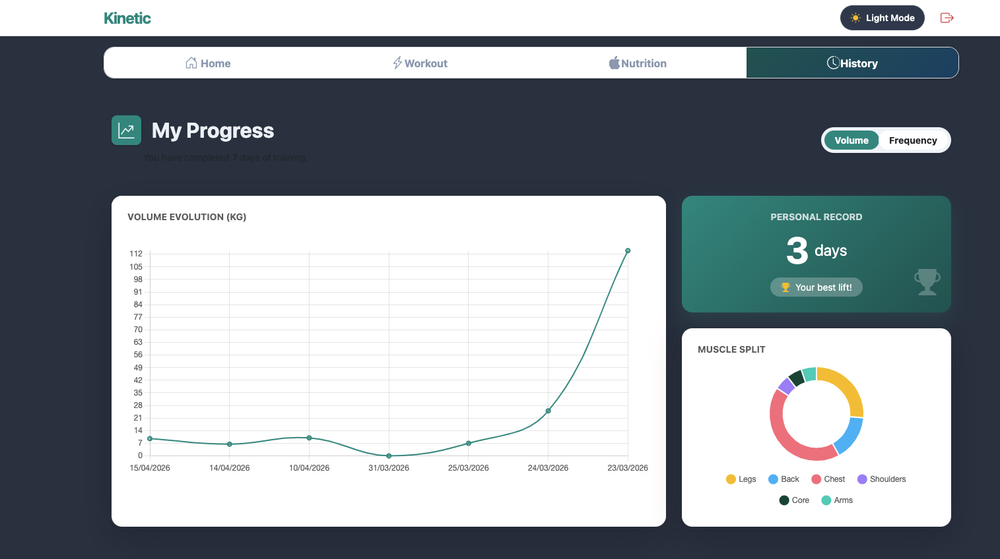

# Kinetic Training App

[🔗 Ver Repositorio en GitHub](https://github.com/NereLopez/app-entrenamiento/tree/master)

**Kinetic** es una Aplicación Web Progresiva (PWA) diseñada para deportistas que buscan un seguimiento visual, rápido y profesional de sus entrenamientos. Desarrollada con **Angular 19**, integra análisis de datos en tiempo real y una experiencia de usuario optimizada para dispositivos móviles.


---

## 🚀 Características Principales

* **Dashboard Dinámico:** Visualización de métricas clave (Volumen y Frecuencia) mediante gráficas interactivas con `Chart.js`.
* **Heatmap de Actividad:** Seguimiento visual del progreso semanal inspirado en los anillos de actividad de Apple Health.
* **Experiencia PWA:** Instalable en iOS y Android. Funciona a pantalla completa, eliminando la interfaz del navegador para una experiencia 100% nativa.
* **Gestión de Entrenamientos:** Sistema de carga de ejercicios y rutinas conectado a servicios reactivos.
* **Modo Oscuro:** Interfaz adaptativa diseñada para entrenamientos en cualquier condición de luz.
* **Acceso mediante QR:** Sistema de invitación para instalación rápida en dispositivos móviles.

---

## 🛠️ Stack Tecnológico

* **Framework:** [Angular 19](https://angular.dev/) (Standalone Components & Signals).
* **Gráficas:** [Chart.js](https://www.chartjs.org/) con `ng2-charts`.
* **Estilos:** Bootstrap 5.3 + CSS3 Custom Properties (Variables para temas).
* **Iconografía:** Bootstrap Icons.
* **PWA:** Angular Service Worker (`@angular/pwa`).

---

## 📱 Instalación (Modo PWA)

Para disfrutar de la experiencia completa en tu smartphone:
1. Escanea el **Código QR** presente en el Dashboard.
2. En iPhone: Pulsa **"Compartir"** y selecciona **"Añadir a la pantalla de inicio"**.
3. En Android: Pulsa en el banner **"Instalar aplicación"** que aparecerá automáticamente.

---

## 🔧 Desarrollo

Para ejecutar el proyecto localmente:

1. Instala las dependencias:
   ```bash
   npm install
2. Levantar el servidor de desarrollo:
    ```bash
    ng serve
3. Accede a http://localhost:4200


Desarrollado por Nerea Elvira López-2026. Proyecto Final de DAM


