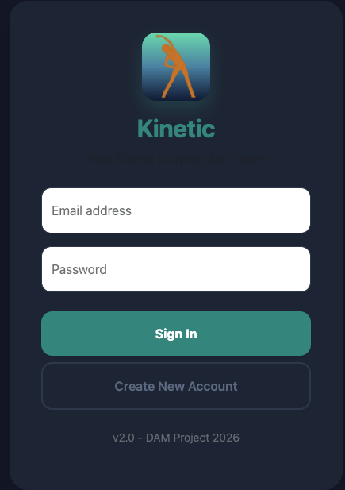
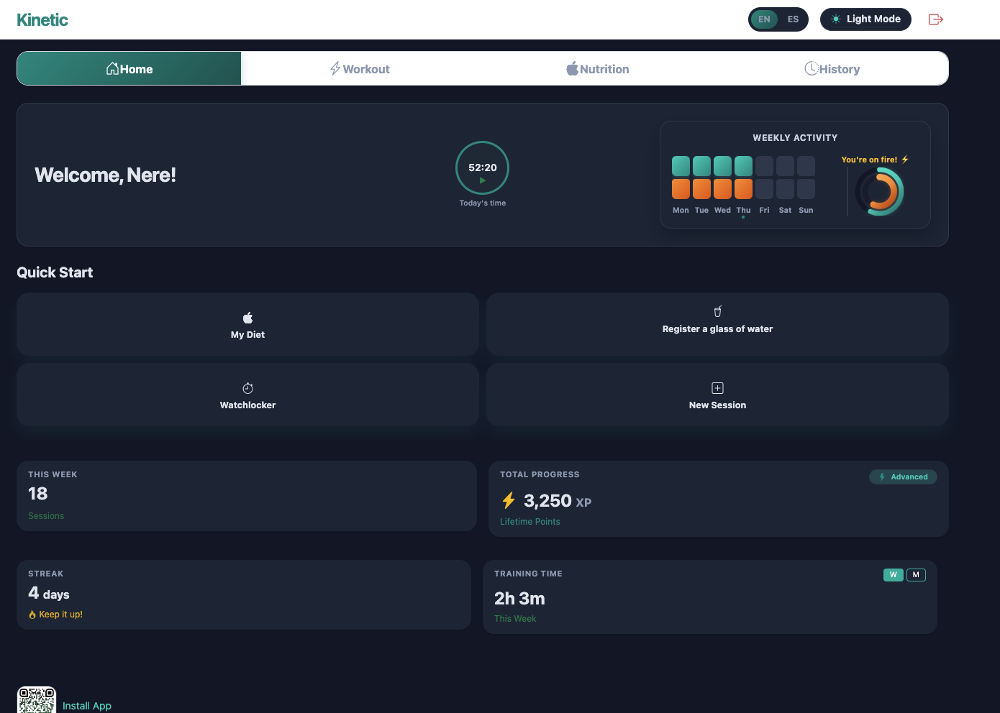
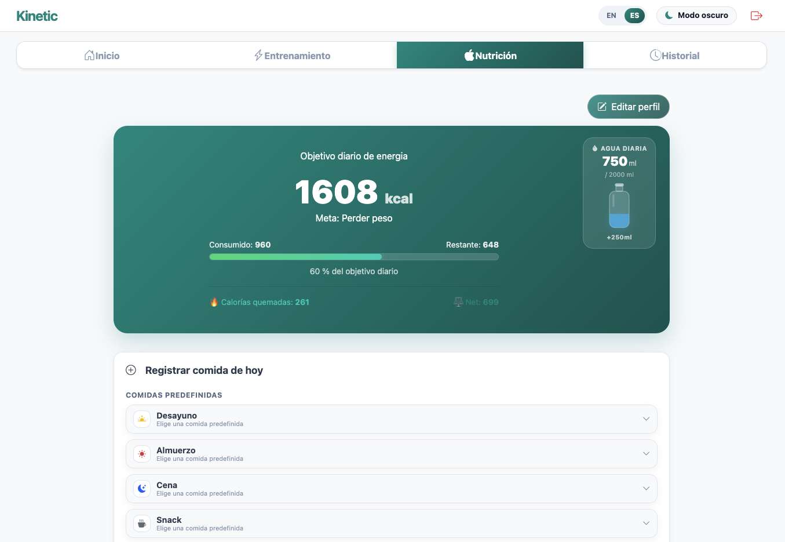
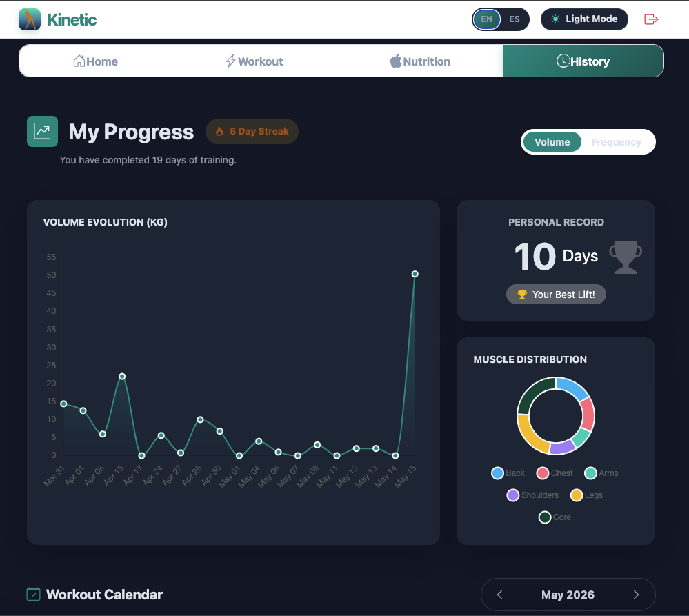

# Kinetic Training App - Fitness Tracking PWA 


<p align="center">
  
</p>


**Kinetic** es una Aplicación Web Progresiva (PWA) enfocada en el seguimiento de entrenamientos, nutrición y progreso físico. Desarrollada con **Angular 19** y **Firebase**, utilizando **Angular Signals** para la gestión reactiva del estado. 


### 🌓 Interfaz y Experiencia de Usuario (Mobile-First)

| Dashboard (Modo Oscuro) | Nutrición (Modo Claro) | Progreso y Análisis |
| :---: | :---: | :---: |
|  |  |  |
| *Acciones rápidas e idiomas*             | *Hidratación interactiva*               | *Análisis de datos* |

La interfaz está diseñada con un enfoque mobile-first, priorizando la experiencia en smartphones mediante diseño responsive, soporte offline y modo oscuro.

---

## 🚀 Arquitectura y Características 

- Registro e inicio de sesión con Firebase Authentication
- Seguimiento de entrenamientos y ejercicios
- Sistema de rachas y gamificación
- Control nutricional y cálculo de calorías/macros
- Dashboard con gráficas y estadísticas
- Formularios dinámicos para diferentes tipos de ejercicios
- Soporte offline gracias a PWA
- Diseño responsive y modo oscuro

---

## 🛠️ Stack Tecnológico

* **Frontend:** 

    - **`Angular 19`**
    - **`TypeScript`**
    - **`Angular Signals`**
    - **`RxJS`**
    - **`Bootstrap 5`**
* **Backend y base de datos:** 

    - **`Firebase Authentication`**
    - **`Cloud Firestore`**
* **Visualization y PWA:** 

    - **`Chart.js`** 
    - **`ng2-charts`**
    - **`Angular Service Worker`** 

---

## 💡 Aspectos técnicos destacados

### 🧠 Estado reactivo con Angular Signals
La aplicación utiliza Signals y `computed()` para gestionar cálculos derivados como calorías, metabolismo basal y objetivos nutricionales.

### 🎛️ Formularios dinámicos
Los entrenamientos se construyen mediante **`FormArray`**, permitiendo adaptar dinámicamente los campos según el tipo de ejercicio.

### 🔊 Optimización de datos
Se utilizan estructuras como `Set` y `Map` para mejorar el rendimiento en cálculos de rachas, calendario y estadísticas.

### 🧭 Experiencia mobile-first
- La aplicación fue diseñada principalmente para smartphones, incluyendo:

  - Navegación táctil
  - Instalación como app
  - Soporte offline
  - Modo oscuro
  - Idiomas español e inglés

## 📱 Instalación (Modo PWA)

Para disfrutar de la experiencia completa en tu smartphone:

1. **Escanea el QR:**

2. En iPhone (Safari): Pulsa **"Compartir"** y selecciona **"Añadir a la pantalla de inicio"**.
3. En Android (Chrome): Pulsa en el banner **"Instalar aplicación"** que aparecerá automáticamente.

---

## 🔧 Configuración en Entorno de Desarrollo

Para ejecutar el proyecto localmente:

1. Clonar el repositorio e instalar las dependencias de Node:
   ```bash
   npm install
   ```
2. Iniciar el servidor de desarrollo local:
    ```bash
    ng serve
    ```
3. Acceder al entorno:
    ```bash
    http://localhost:4200
    ```
---

## 📚 Lo que aprendí con este proyecto

- Arquitectura moderna en Angular
- Gestión de estado reactivo
- Formularios complejos
- Optimización de renderizado
- Integración con Firebase
- Diseño responsive mobile-first
- Desarrollo de PWAs

---

## 🔮 Próximas mejoras

- Backend propio con NestJS
- Migración a PostgreSQL
- Roles de usuario
- Panel de administración
- Testing
- Docker y despliegue automatizado

---

Desarrollado por Nerea Elvira López 2026. Proyecto Final de DAM


